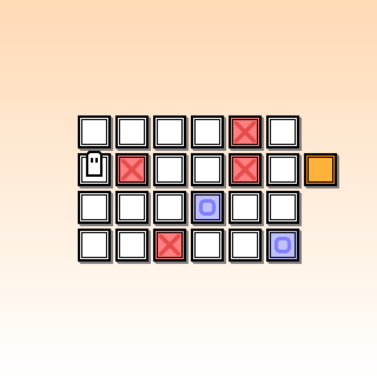
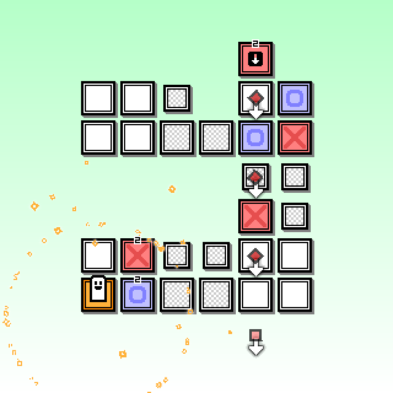

>puzzle game

/imglist open

/imglist close

Z, X키를 적절히 활용하면서,  
장애물에 맞지 않게  
도착 지점(주황색 블록)까지 가면 되는 퍼즐 게임입니다.

### 조작법

이동(Movement) : ← ↓ ↑ →  
텔레포트(Teleport) : Z  
한 타임 머무르기(Pass one turn) : X  
재시작(Restart) : R  

### 음악

BGM : 라컨(dkaghans) - 도시의 평화  
감사합니다!

---

### download ▼
: [HANDHELD_PUZZLE.zip (Win)](files/HANDHELD_PUZZLE.zip)
