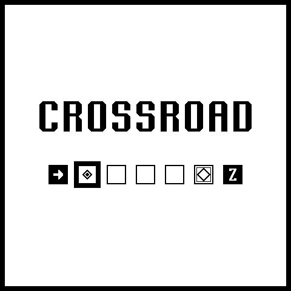
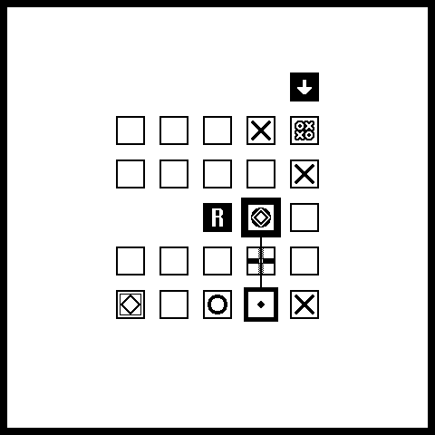
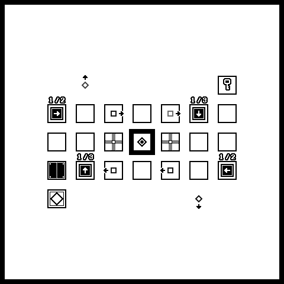
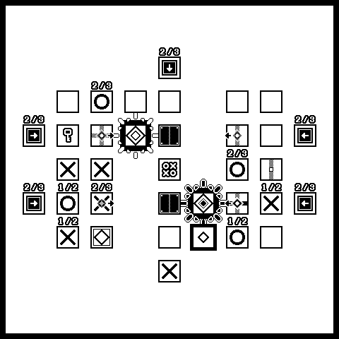
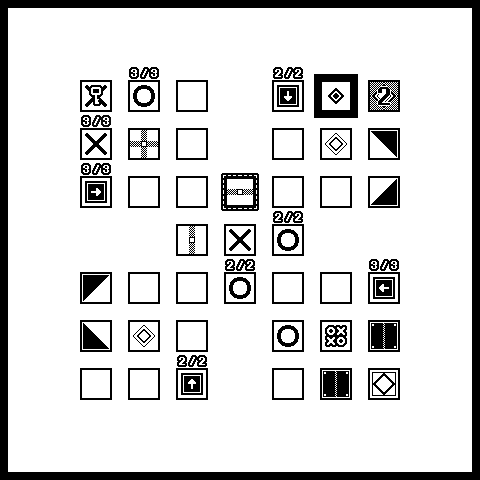

>puzzle game

/imglist open

/imglist close
/imglist open

/imglist close

GMS1.4로 만들었던 게임을 GMS2로 포팅했습니다.  
지원하지 않는 함수도 수정하고, 기능과 스테이지도 몇 개 더 추가했습니다.

예상치 못한 버그가 있을 수도 있지만..! 가볍게 즐겨주시길 :)

### 조작법

방향 선택 및 이동(Select direction or move) : ← ↓ ↑ →  
이동 및 한 턴 쉬기(Move or pass one turn) : Z  
취소(Cancel) : X  
텔레포트 및 블록 회전(Teleport or rotate the block) : C  
재시작(Restart) : R  
무음(Mute) : M  
콜렉션 보기(View collection) : SPACEBAR  
뒤로가기(Back) : ESC, BACKSPACE  
화면크기 변경(Change window size) : 1, 2  

---

Log  
ver 2.0.0.1 : bugs fixed.

---

### download ▼

`Win(exe)` [Itch.io](https://f-works.itch.io/crossroad)
`Android` [Google Play](https://play.google.com/store/apps/details?id=works.f.crossroad&pcampaignid=web_share)
