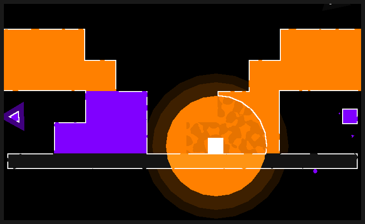

>A simple platformer game that includes puzzle elements using colors.

/imglist open

/imglist close

<iframe src="https://www.youtube.com/embed/lIIkXq62Xwk?si=MQfEwX4vw5lWmE2C" title="YouTube video player" frameborder="0" allow="accelerometer; autoplay; clipboard-write; encrypted-media; gyroscope; picture-in-picture; web-share" allowfullscreen></iframe>

'[KGMC 게임 제작 이벤트 - 문자가 없는 세상](https://cafe.naver.com/crazygm/229833)' 에 참가하였습니다 :)

​
이번에는 색상을 이용하는 간단한 플랫포머 퍼즐 게임입니다.

최소한의 도형과 색상만을 이용해서 게임을 표현해보았는데,
제 의도처럼 메시지 전달이 직관적으로 잘 전달되었으면 좋겠군요 (빵긋)

​
오랜만에 직접 작곡해보았습니다만, 8비트 음악이 아닌 것은 처음이네요.
정말 어려웠습니다.. 배울 것이 너무 많아요..
그래도 재밌는 시간이었습니다

플레이타임이 그리 긴 게임은 아니지만, 재밌게 즐기다가 가셨으면 좋겠네요

모두 즐거운 밤 보내시길!

---

### download ▼
`GameJolt` : [f_works.gamejolt.io/rgb](https://gamejolt.com/games/rgb/830124)
`Itch.io` : [f-works.itch.io/rgb](https://f-works.itch.io/rgb)

### soundtrack ▼
`soundcloud` : [soundcloud.com/f_works/sets/soundtrack](https://soundcloud.com/f_works/sets/soundtrack)
