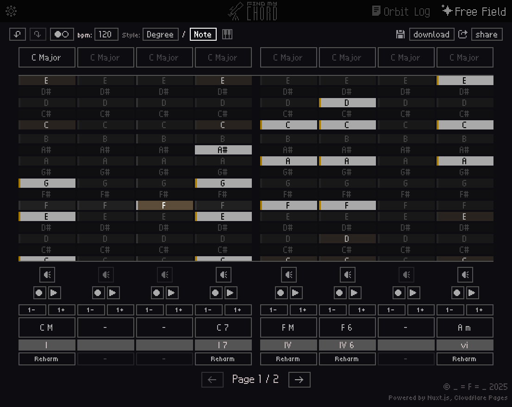
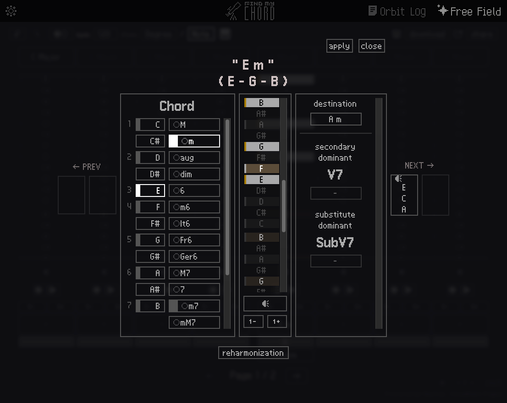

/imglist open

/imglist close

**[FIND MY CHORD](https://find-my-chord.with-1f.work)**

**코드 진행이나 화음을 찾는데 도움을 주는 사이트**입니다.

마스터키보드 없이 마우스로 노트를 찍어가며 원하는 음이나 스케일을 찾을 때 시간이 너무 오래 걸리더라고요. 음악 관련 전공자도 아니라서 매일 건반을 두드리며 연습할 수도 없었기에 좀 더 편하게 작곡할 수 있게 도와주는 도구를 한 번 만들어보자 싶어서 만들게 된 사이트입니다.

사실 개인적으로 사용하려고 만든거라 기능적으로나 접근성으로나 부족한게 많긴 합니다만.. 이 부분은 너그럽게 봐주시길 :)

사이트 사용법은 [find my chord | orbit log](https://find-my-chord.with-1f.work/orbit_log) 여기에서 확인할 수 있습니다 :)

---

이 사이트는 **Nuxt**로 만들어졌습니다. 빵긋
